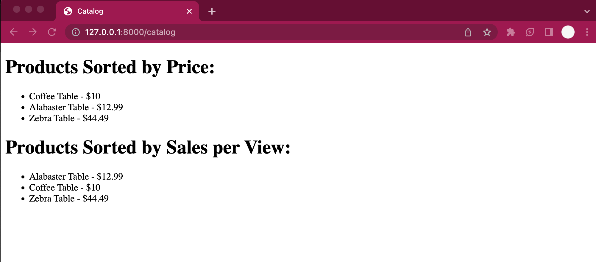

Product Catalog Sorting Solution for Scnip

This is a solution for sorting a product catalog based on different criteria using PHP and the Laravel framework. The code demonstrates the use of object-oriented programming, design patterns, and clean code principles.

this is the solution to the coding challenge

